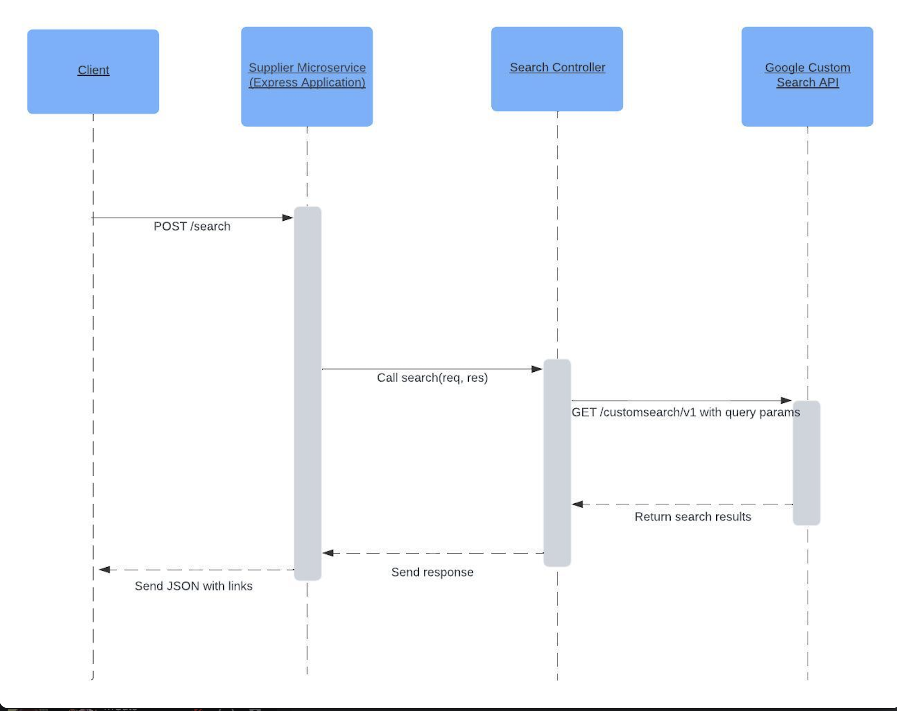

# Supplier Search Microservice

This microservice allows users to search for electrical wire suppliers based on specific criteria: wire size, cost per unit, and impedance. It utilizes the Google Custom Search API to fetch relevant supplier links based on the provided input.

## Setup Instructions

1. Clone this repository: `git clone https://github.com/mikecalo/cs361_supplier_microservice`
2. Navigate to the project directory and install dependencies using: `npm install`
3. Set environment variables: Create a `.env` file in the root directory and add the following environment variables:

    ```plaintext
    GOOGLE_API_KEY=YOUR_GOOGLE_API_KEY
    SEARCH_ENGINE_ID=YOUR_SEARCH_ENGINE_ID
    ```

    Replace `YOUR_GOOGLE_API_KEY` with your Google API key and `YOUR_SEARCH_ENGINE_ID` with your Custom Search Engine ID.

4. Run the following command to start the microservice: `node index.js`. You should see a message in the console that reads `Show Supplier Microservice running on port 3000`. The microservice will start running on port 3000 by default. You can change the port in the index.js file if needed.

### Note on Using Google API

To use the Google Custom Search API, you need to obtain an API key and a Custom Search Engine ID from the Google Developer Console. These credentials are required for accessing the API and performing searches. Users are responsible for providing their own credentials by setting them in the `.env` file.

For more information on setting up and using the Google Custom Search API, refer to the [official documentation](https://developers.google.com/custom-search/v1/overview).


## Requesting Data from the Microservice

To search for suppliers, send a POST request to the /search endpoint with the following JSON payload:

```JSON
{
    "wireSize": "12",
    "costPerUnit": "0.10",
    "impedance": "0.1"
}
```

Replace the values with your desired criteria. The microservice will return the top 3 supplier links based on the search query.

## Receiving Data from the Microservice

The response will be a JSON object containing an array of supplier links. Example response:

```JSON
{
    "links": [
        "https://example.com/supplier1",
        "https://example.com/supplier2",
        "https://example.com/supplier3"
    ]
}
```

## Example Test Program

Here's a simple test program in Python that calls the microservice and displays the information returned:

```python
import requests
import json

def test_microservice():
    url = "http://localhost:3000/search"
    payload = {
        "wireSize": "12",
        "costPerUnit": "0.10",
        "impedance": "0.1"
    }
    headers = {
        "Content-Type": "application/json"
    }

    response = requests.post(url, headers=headers, data=json.dumps(payload))

    if response.status_code == 200:
        links = response.json().get("links", [])
        if links:
            print("Supplier Links:")
            for i, link in enumerate(links, 1):
                print(f"{i}. {link}")
        else:
            print("No supplier links found.")
    else:
        print("Error:", response.json().get("error", "Unknown error occurred"))

if __name__ == "__main__":
    test_microservice()

```




